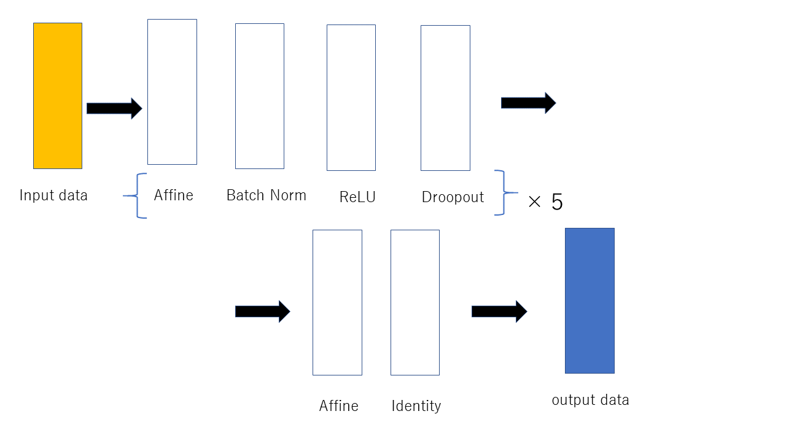

#stock_MultiLayerNet  
株価（終値）と単純移動平均との差、月、業種  
から次の日の株価がどの程度上がるか下がるかを予測する  
  
  
#Optimizer  
SGD acc:46.66%  
Adam acc: 47.39%  
  
#requierments 
numpy  
pandas  

#hyper-parameter  
1, leaning rate  
2, Weight decay  

#How to use  
`python get_make_data/get_code_num.py  銘柄番号の取得`  
`python get_make_data/get_stock_data.py  株価データの取得`  
`python get_make_data/Granville_low.py  データの整形`  
`python main_train.py  学習`  

#example
`python stock_predict 6501`  
`$上昇 Close:684`
